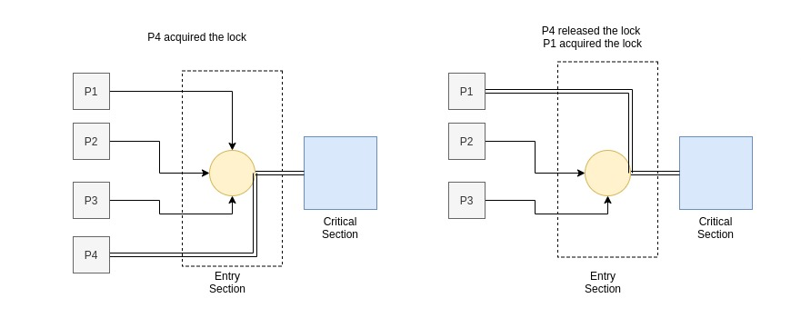
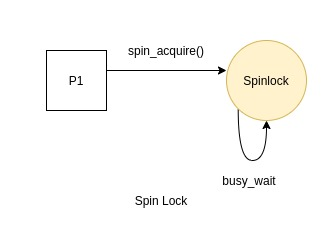
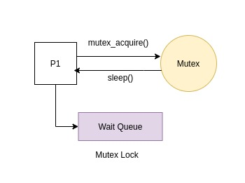

# Many One Model

The many to one mapping is used to multiplex all threads onto a single kernel thread. This results in pure user land threading. Such threads cannot take advantage of a multiprocessor system since they run concurrently instead of parallely. But as compared to One-One threads they have the advantage of low thread creation and context switching overhead. Their biggest disadvantage is when using syscalls since, suspension of the kernel thread means suspension of all user level threads. The kernel has no information about these threads and all thread management is done in user land.

- ## Thread Creation

  <b>API:</b>

  - `int thread_create(thread *t, void *attr, void *routine, void *arg)`

  <b>Arguments:</b>

  | Name           | Description                                 |
  | -------------- | ------------------------------------------- |
  | thread \*t     | Pointer to a thread object                  |
  | void \*attr    | Attributes to be passed for thread creation |
  | void \*routine | Function that the thread runs               |
  | void \*arg     | Arguments to the function call              |

  Thread creation is done by manually defining a context of the type sigjmp_buf and manipulating it to start at the passed function. Upon thread creation, the TCB for the thread is initialised to help with bookkeeping, and the thread is added to a queue.

  <b> Stack allocation: </b>

  Since each thread needs a seperate stack to run, the call to allocStack() in thread_create() ensures that a stack is allocated for each thread. This function uses `mmap()` to allocate a stack of size STACK_SZ by default. The stack size can also be passed as a user defined attribute. Optionally, this function can set the first page of the stack as a guard page using `mprotect()`.

  <b> translate_address() and glibc pointer mangling: </b>

  glibc implements a security feature called "pointer mangling" or "pointer guard" in order to protect against certain vulnerabilities. Since the context switching happens using functions from the setjmp library, which is also a part of glibc, it is required that the SP, BP and PC set in `createContext()` are mangled with the help of the `translate_address()` function. The `JB_SP`, `JB_BP` and `JB_PC` values also change depending on the architecture. Both these things introduce some system specificity into the library. This library also assumes that the stack growing direction is downwards, which may not be the case with all architectures.

  Creation of a many one thread should take a routine (function pointer) that the thread will execute, arguments to the function call and attibutes that the thread can be initialised with.

  <b>Return Value:</b>
  The thread ID of the new thread is set in the argument `t`.
  A successful call returns `0`. Upon error appropriate error code is returned.

- ## Thread Join

  <b>API:</b>

  - `int thread_join(thread t, void **retVal)`

  <b>Arguments:</b>

  | Name            | Description                                                          |
  | --------------- | -------------------------------------------------------------------- |
  | thread t        | Thread ID of the thread to be waited on                              |
  | void \*\*retVal | Location where the return value of terminated thread is to be stored |

  The `thread_join()` call waits for a thread to terminate. The thread can be specified by a Thread ID passed as argument. The calling thread will then wait for the target thread to terminate before going ahead in its execution flow. If the target thread has been terminated already, the call to `thread_join()` returns immediately. After the call has returned successfully, the calling thread can be sure that the target thread has exited.

  If the target thread has not exited yet, the calling thread is added to a list of waiters in the tcb of the target thread and the state of the calling thread is set to WAITING. Following this, the thread yields control non-preemptively by switching to the scheduler.

  <b>Return Value:</b>
  The return value of the exited thread can be obtained by specifying a location `retVal`.
  On success a call to `thread_join()` returns `0`. On an error, appropriate error code is returned.

- ## Thread Kill

  <b>API:</b>

  - `int thread_kill(thread t,int signum)`

  <b>Arguments:</b>

  | Name       | Description                               |
  | ---------- | ----------------------------------------- |
  | thread t   | Thread ID of the thread to send signal on |
  | int signum | Signal number                             |

  thread_kill() will send a signal to the desired thread in either a synchronous/asynchronous manner as specified below. Synchronous signals are disposed with a call to `raise()` while, asynchronous signals are disposed by adding the signal to a queue of pending signals, the queue is a part of the TCB of the thread. These pending signals are disposed to the target thread just before returning control to the target thread from the scheduler.

  `tlib` uses two types of signal dispositions.

  - <b>Process wide signals:</b> `SIGINT, SIGCONT, SIGSTOP`
    These signals are sent to all the threads running as a part of the process. The action will be asynchronous and hence all the threads will be sent the respective signal.
  - <b>Thread specific signals:</b> `SIGSEGV, SIGTERM, SIGABRT, SIGFPE`
    These signals are delivered to only specific signals and there are custom handlers to handle the delivery of the signals. These signals are synchronous hence they wont have affect on any other threads that run in the process group.

  <b>Return Value:</b>
  On a successful call it returns `0`. On an error `-1` is returned.

- ## Thread Exit

  <b>API:</b>

  - `void thread_exit(void *retVal)`

  <b>Arguments:</b>
  | Name | Description |
  | ---------- | ----------------------------------------- |
  | void \*retVal| Location where the return value of the thread is to be stored |

  Calling `thread_exit()` from the current thread simply marks the thread as exited and immediately yields control to the scheduler. Since the scheduler does cleanup of all exited functions at the beginning, the resources used by the thread are freed.

  <b>Return Value:</b>
  If the argument to the function is not `NULL`, then the return value of the thread will be saved at that location.
  The function does not return any value.

- ## Thread Attributes

  The threads can have muliple attributes that define the creation and joining of the threads. Few of the attributes implemented are:

  1.  `Stack Size` - Lets the user set and get the size of the stack for the current thread
  2.  `Guard Size` - Lets the user set and get the size of the guard page of the stack that helps in stack protection.
  3.  `Stack Address` - Defines the stack region that the thread uses.
  4.  `Scheduling Interval` - Defines the scheduling interval (or how frequently a SIGVTALRM will be raised) in seconds and microseconds.

  <b>Note:</b> The attributes object should be initialized before use using `thread_attr_init()` and should be passed as an argument to the call of the `thread_create()` and these attributes should be set using the respective setter functions. A good programming practice is to free the attribute object by calling the `thread_attr_destroy()` function call.
  Undefined behaviour will result if an invalid size or address is passed as argument to the thread.

- ## Synchronization Primitives

  When multiple threads are trying to modify a shared resource, the order of execution has a significant impact on the results and hence the correctness of the program is compromised. This is commonly known as the race problem and happens when multiple threads are in contention of a common resource. Every thread in such a sequence has three areas:

  - Entry section
  - Critical section
  - Remainder section

  Locks are used to make sure that the access to the shared resouce is serialized. Every thread has to hold a lock in the entry section and then proceed towards the critical section. If however, the lock has already been acquired by some other process, then the other process are made to wait. This ensures that there is an order in which threads update the common resource.

    

      
    

  `tlib` provides two types of synchronization primitives namely `spinlock` and a `mutex`.

  1.  <b>Spinlocks</b>
      Spinlocks are locking mechansims wherein the waiting threads do not sleep, instead they do a busy waiting for the lock, trying to see if the lock is available in successive CPU cycles. The entry section of the code checks if the lock is already acquired by some other thread and if it is then the thread goes in a busy wait loop. Once the lock has been released, the thread can then acquire the lock during one of its cycles.
      

          
      

  2.  <b>Mutex</b>
      Threads which try to access a critical section are made to acquire a lock in their entry sections. Mutex lock once acquired by a thread leave all other threads trying to acquire the same lock in a sleeping state. This ensures that only one thread has a lock when the critical section is being accessed.
      If threads try to acquire a lock that is already held by another thread, the state of the thread is changed to SLEEPING and they immediately yield control to the scheduler. The mutexWait variable in their TCB is set to the lock address to indicate which lock they are waiting for. Whenever a thread calls mutex_release(), it implicitly calls unlockMutex() which sets the first thread in the queue that was waiting for this lock (has mutexWait set to this lock's address) to RUNNABLE, the next scheduler invocation will ensure that this thread is scheduled since it can now acquire the lock. Only one thread waiting for the lock is woken up since even if all are woken up, only the thread that occurs earlier in the thread queue can acquire the lock.
       
        

            
      

      
      The Many-One implementation also ensures that only a thread which has acquired a mutex or spinlock can release it. If this condition is not met, the unlock functions return an error number.

        <b>Note: The Many-One code makes lock operations atomic by disabling interrupts at the start of each locking related function and enabling them before the function returns. This is implemented by providing the locking code access to certain scheduler variables by declaring them as extern.</b>

- ## Scheduling Policies

  The One One implementation of `tlib` uses a System Contention Scope for scheduling whereas the Many One implementation uses the Process Contention Scope for scheduling. The Process Contention Scope is a simple Round Robin based scheduling on either a preemptive or a non preemptive basis. The processes yeild to a CPU when they exit or move to a waiting queue. Also the processes can be moved to the ready queue when the timer interrupt occurs.

- ## Performance

  Multithreading can significantly increase performance depending on the type of the application program and the use of threading. The choice of number of threads and threading model used can have an impact on the results based on the computer architecture.
  The following results were obtained on running a matrix multiplication program in a single and a multithreaded model using `tlib`:

  | Input Size  | Single Threaded Time | Multi Threaded Time |
  | ----------- | -------------------- | ------------------- |
  | 10 x 10     | 0.059s               | 0.034s              |
  | 100 x 100   | 0.139s               | 0.188s              |
  | 200 x 200   | 0.311s               | 0.409s              |
  | 500 x 500   | 3.648s               | 3.139s              |
  | 800 x 800   | 12.232s              | 10.310s             |
  | 1000 x 1000 | 26.445s              | 19.064s             |

  <i>Tested on Linux kernel 5.4, CPU - Intel(R) Core(TM) i3-6006U CPU @ 2.00GHz</i>

  <i>SCHED_INTERVAL value = 100 microsecs</i>
