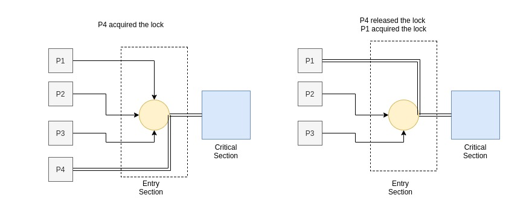
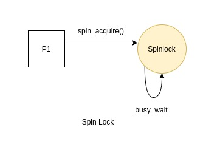
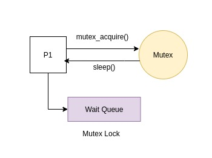

# One One Model

The one to one mapping is used to map each user level thread to an exclusive kernel level thread. All the mapped threads can run either concurrently on the same processor or parallely on multiprocessors. The kernel manages the resources and scheduling of the thread. Linux provides the `clone()` system call to create a thread. The routine that the thread will run and the stack that it will use needs to be set by the user library.

- ## Thread Creation

  <b>API:</b>

  - `int thread_create(thread *t, void *attr, void *routine, void *arg)`

  <b>Arguments:</b>

  | Name           | Description                                 |
  | -------------- | ------------------------------------------- |
  | thread \*t     | Pointer to a thread object                  |
  | void \*attr    | Attributes to be passed for thread creation |
  | void \*routine | Function that the thread runs               |
  | void \*arg     | Arguments to the function call              |

  Thread creation relies on `clone` system call. `clone()` system call helps have precise control over the execution context that is to be shared between the parent and the child processes. Creation of a one one thread should take a routine (function pointer) that the thread will execute, arguments to the function call and attibutes that the thread can be initialised with.

  ##### Important flags related to the clone system call.

  ```js
  - CLONE_VM
  	Shares Memory Space accross the process and the thread
  - CLONE_FS
  	Share the filesystem information between the parent
  	and the child
  - CLONE_FILES
  	Shares the list of file descriptors between the parent
  	and the child
  - CLONE_PARENT_SETTID
  	Before returning, the parent process sets the thread id at the
  	location specified to clone
  - CLONE_CHILD_CLEARTID
  	After the thread terminates, the child will clear the
  	thread id that was set at location previously by parent
  - CLONE_THREAD
  	Child thread is placed in the same thread group as the
  	calling process
  - CLONE_SIGHAND
  	Shares the list of signal handlers between the child
  	and the parent process
  - CLONE_SYSVSEM
  	Share a single list of semaphore adjustment from System V
  ```

  The `clone()` system call can be invoked on a per thread basis for creating a LWP in the kernel. The creation should make sure that the thread id returned by the clone system call is set in the thread that was passed as the argument to the call of create.
  Since the threads have a seperate stack region, a stack needs to be allocated and should be passed as an argument to the call to the `clone()` call. We need a stack of some size which is a mulitple of the page size of the system and an extra page which can be used for stack protection. This is the guard page that can be used to prevent stack overflow or memory leak issues. The base address of the memory aligned stack created using `mmap()` and the protected page created via `mprotect()` is then passed to the `clone()` call. The child process has a seperate stack but shares the memory space, signals and files from its parent and is part of the same thread group as that of the parent.
  <br>
  <b>Return Value:</b>
  The thread ID of the new thread is set in the argument `t`.
  A successful call returns `0`. Upon error appropriate error code is returned.

- ## Thread Join

  <b>API:</b>

  - `int thread_join(thread t, void **retVal)`

  <b>Arguments:</b>

  | Name            | Description                                                          |
  | --------------- | -------------------------------------------------------------------- |
  | thread t        | Thread ID of the thread to be waited on                              |
  | void \*\*retVal | Location where the return value of terminated thread is to be stored |

  The `thread_join()` call waits for a thread to terminate. The thread can be specified by a Thread ID passed as argument. The calling thread will then wait for the callee thread to terminate before going ahead in its execution flow. If the callee thread has been terminated already, the call to `thread_join()` returns immediately. After the call has returned successfully, the calling thread can be sure that the callee thread has exited.

  The waiting on the desired thread is acheived via `futex()` system call. All threads, during creation store their Thread ID at a location specified to clone and after a thread has exited, the value at that location gets cleared. `futex()` call is issued by the calling thread and the wait proceeds till the value of thread ID is cleared by the `clone()`. On successful termination, the `futex()` wake wakes up the calling thread and returns control.
  <br>
  <b>Return Value:</b>
  The return value of the exited thread can be obtained by specifying a location `retVal`.
  On success a call to `thread_join()` returns `0`. On an error, appropriate error code is returned.

- ## Thread kill

  <b>API:</b>

  - `int thread_kill(thread t,int signum)`

  <b>Arguments:</b>

  | Name       | Description                               |
  | ---------- | ----------------------------------------- |
  | thread t   | Thread ID of the thread to send signal on |
  | int signum | Signal number                             |

  Thread kill will send a signal to the desired thread in either a synchronous/asynchronous manner as specified below. The signals are disposed with a call to the `tgkill()` system call.

  `tlib` uses two types of signal dispositions.

  - <b>Process wide signals:</b> `SIGINT, SIGCONT, SIGSTOP`
    These signals are sent to all the threads running as a part of the process. The action will be asynchronous and hence all the threads will be sent the respective signal.
  - <b>Thread specific signals:</b> `SIGSEGV, SIGTERM, SIGABRT, SIGFPE`
    These signals are delivered to only specific signals and there are custom handlers to handle the delivery of the signals. These signals are synchronous hence they wont have affect on any other threads that run in the process group.

  <b>Return Value:</b>
  On a successful call it returns `0`. On an error `-1` is returned.

- ## Thread Exit

  <b>API:</b>

  - `void thread_exit(void *retVal)`

  <b>Arguments:</b>
  | Name | Description |
  | ---------- | ----------------------------------------- |
  | void \*retVal| Location where the return value of the thread is to be stored |

  A successful thread routine calls `thread_exit()` implicitly to clean any resources used by it. In addition, `thread_exit()` can be invoked by the routine of any thread to exit its control flow.
  The `clone()` system call ensures that the Thread ID gets reset at the location to signal all waiting threads about the termination of the current thread.
  <br>
  <b>Return Value:</b>
  If the argument to the function is not `NULL`, then the return value of the thread will be saved at that location.
  The function does not return any value.

- ## Thread Attributes

  The threads can have muliple attributes that define the creation and joining of the threads. Few of the attributes implemented are:

  1.  `Stack Size` - Lets the user set and get the size of the stack for the current thread
  2.  `Guard Size` - Lets the user set and get the size of the guard page of the stack that helps in stack protection.
  3.  `Stack Address` - Defines the stack region that the thread uses.

  <b>Note:</b> The attributes object should be initialized before use using `thread_attr_init()` and should be passed as an argument to the call of the `thread_create()` and these attributes should be set using the respective setter functions. A good programming practise is to free the attribute object by calling the `thread_attr_destroy()` function call.
  Undefined behaviour will result if an invalid size or address is passed as argument to the thread.

- ## Synchronization Primitives

  When multiple threads are trying to modify a shared resource, the order of execution has a significant impact on the results and hence the correctness of the program is compromised. This is commonly known as the race problem and happens when multiple threads are in contention of a common resource. Every thread in such a sequence has three areas:

  - Entry section
  - Critical section
  - Remainder section

  Locks are used to make sure that the access to the shared resouce is serialized. Every thread has to hold a lock in the entry section and then proceed towards the critical section. If however, the lock has already been acquired by some other process, then the other process are made to wait. This ensures that there is an order in which threads update the common resource.

    

  `tlib` provides two types of synchronization primitives namely `spinlock` and a `mutex`.

  1.  <b>Spinlocks</b>
      Spinlocks are locking mechansims wherein the waiting threads do not sleep, instead they do a busy waiting for the lock, trying to see if the lock is available in successive CPU cycles. The entry section of the code checks if the lock is already acquired by some other thread and if it is then the thread goes in a busy wait loop. Once the lock has been released, the thread can then acquire the lock during one of its cycles.
      

  2.  <b>Mutex</b>
      Threads which try to access a critical section are made to acquire a lock in their entry sections. Mutex lock once acquired by a thread leave all other threads trying to acquire the same lock in a sleeping state. This ensures that only one thread has a lock when the critical section is being accessed. Further, once the thread is done with the lock, it releases the lock and all the waiting threads are woken up. The threads then contest for the locks once again. This sleep wait mechanism has been implemented with the help of `futex()` system call and guarantees that operations for waiting on a lock are atomic in nature.

  

- ## Scheduling policies

  The One One implementation of `tlib` uses a System Contention Scope for scheduling whereas the Many One implementation uses the Process Contention Scope for scheduling. The Process Context Scope is a simple Round Robin based scheduling on either a preemptive or a non preemptive basis. The processes yeild to a CPU when they exit or move to a waiting queue. Also the processes can be moved to the ready queue when the timer interrupt occurs.

- ## Performance

  The following results were obtained on running a matrix multiplication program in a single and a multithreaded model using `tlib`:

  | Input Size  | Single Threaded Time | Multi Threaded Time |
  | ----------- | -------------------- | ------------------- |
  | 10 x 10     | 0.019s               | 0.017s              |
  | 100 x 100   | 0.043s               | 0.045s              |
  | 200 x 200   | 0.121s               | 0.117s              |
  | 500 x 500   | 0.942s               | 0.763s              |
  | 800 x 800   | 3.307s               | 2.506s              |
  | 1000 x 1000 | 6.555s               | 4.737s              |

  <i>Tested on Linux kernel 5.8, CPU - Ryzen 7 4800H</i>
